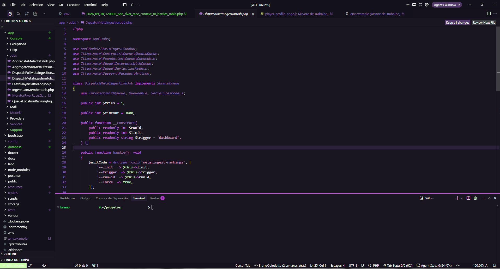

# SEELE — Nerv and Evangelion Themes

Seele has paused its research into humanoid robots and decided to dedicate its time to creating humanoid IDEs.

The Type-01—Shogōki—is now available for testing; all qualified pilots are summoned to test it.

# Included Themes

## **Evangerion Shogōki (EVA-01)**

Install the extension and open a code file to see syntax highlighting, an integrated terminal, and an editor UI with a consistent visual identity.

Suggestions for improvements can be submitted via [Github Issues](https://github.com/BrunoQuiodetto/SEELE-Extension/issues)

## 🌟 Leave a Review

If your synchronization rate with Shogōki was a success and you are enjoying the experience, consider supporting the theme with a 5-star review! Your feedback helps the project grow and reach more pilots.

* [Leave a review on the VS Code Marketplace](https://marketplace.visualstudio.com/items?itemName=BrunoQuiodetto.evangelion-theme#review-details)
* [Leave a review on Open VSX (Cursor, VSCodium)](https://open-vsx.org/extension/BrunoQuiodetto/evangelion-theme/reviews)

## License

[MIT](LICENSE) — Copyright (c) 2026 Bruno Quiodetto.

## Author

**Bruno Quiodetto** — [Mail](mailto:bruno@quiodetto.dev)

Repository: [Github](https://github.com/BrunoQuiodetto/SEELE-Extension)

---

*Neon Genesis Evangelion* is the property of its respective owners. This project is a fan-made theme with no official affiliation.